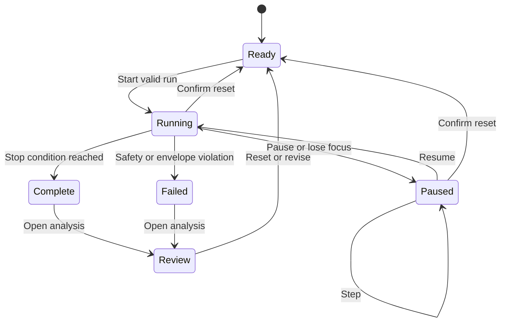
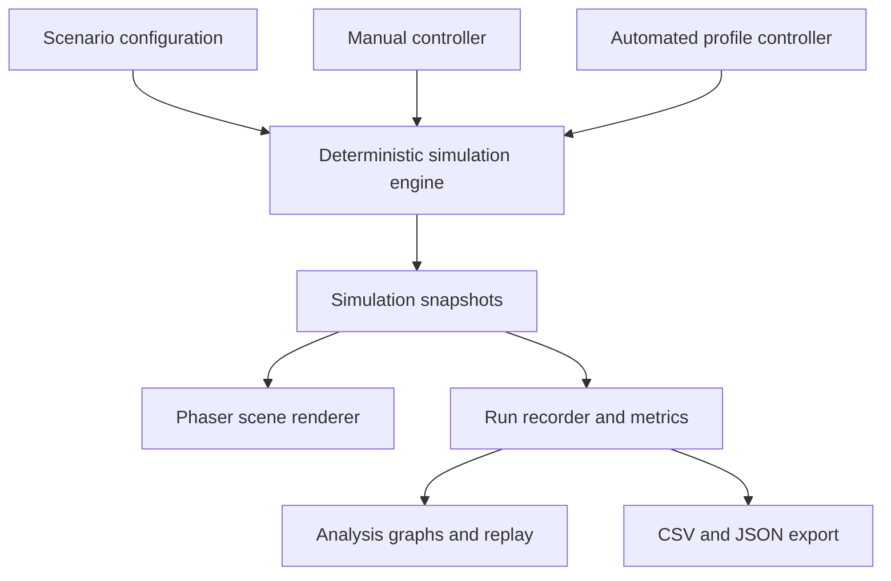

# Portside Motion Lab

## Product and Implementation Specification

**Status:** Proposed v0.1  
**Course:** ENGR-120 Introduction to Engineering  
**Primary use:** Kinematics lab, with planned extensions for dynamics, statics, energy, controls, and optimization  
**Working title:** Portside Motion Lab  
**Target platform:** Desktop web browser; Canvas LMS-compatible embed; no sign-in required

---

## 1. Product decision

Build a two-dimensional, side-view gantry-crane simulator inspired by container-handling operations at the Port of Long Beach. Students operate a trolley, hoist, spreader (the container-specific gripper), and suspended container. Their engineering objective is to move cargo from a ship to a target bay quickly while respecting limits on speed, acceleration, load shift, load swing, clearance, and final position.

The first release should concentrate on one excellent kinematics experience rather than attempting to simulate an entire port. Manual and automated operation must use the same deterministic physics model and data recorder. Later lab modules should reveal additional parts of that same model instead of creating separate simulators.

This should be a 2D sprite-based simulation. Two dimensions are an advantage here: the crane's horizontal trolley motion, vertical hoist motion, velocity profile, and suspended-load behavior are readable in side elevation and map directly onto the mathematics used in class. A 3D environment would add camera and asset complexity without adding useful introductory physics.

### Core student experience

1. Try the transfer manually with the arrow keys.
2. See the motion as position, velocity, and acceleration data.
3. Calculate a better piecewise motion profile.
4. Enter that profile in automated mode.
5. Run, inspect, and revise it.
6. Deliver the container safely and explain the tradeoff between speed and cargo protection.

The key conceptual shift is that students are not calculating kinematics merely to hit a target. They are designing motion for an actual class of machine under operational constraints.

---

## 2. Educational purpose

### 2.1 Primary learning outcomes for the kinematics lab

By the end of the first lab, students should be able to:

- distinguish position, velocity, and acceleration in a machine-motion context;
- interpret aligned position-time, velocity-time, and acceleration-time graphs;
- model motion as a sequence of constant-acceleration intervals;
- calculate displacement and final velocity across multiple intervals;
- design an accelerate-cruise-decelerate profile that starts and ends at rest;
- evaluate a design against maximum-speed, maximum-acceleration, final-position, and cycle-time requirements;
- compare predicted motion with simulated results and explain discrepancies;
- explain why a fast compliant solution is better engineering than simply maximizing speed.

### 2.2 The first lab scenario

**Scenario name:** Fragile Freight Transfer

> A container of sensitive equipment must be moved from the ship to the landside transfer bay. Excessive acceleration can cause unsecured cargo inside the container to shift. Deliver the container as quickly as possible without exceeding the cargo limit, striking an obstacle, or arriving with residual motion.

The first scenario should isolate horizontal trolley motion after the container has been lifted to a safe travel height. This keeps the initial calculation one-dimensional. A short visual introduction may show the pickup, but the graded engineering task begins with the suspended container at rest and ends when it is centered over the target bay at rest.

### 2.3 Recommended 100-minute lab flow

| Time | Activity | Student output |
| ---: | --- | --- |
| 10 min | Scenario briefing and controls tutorial | Requirements marked on worksheet |
| 10 min | Manual transfer attempt | Run record and first observations |
| 15 min | Analyze manual position, velocity, and acceleration graphs | Written graph interpretation |
| 20 min | Calculate an automated motion profile | Predicted phase table and final position |
| 20 min | Enter and run the automated profile | First automated run record |
| 15 min | Revise for compliance or shorter cycle time | Final run record |
| 10 min | Compare prediction and result; submit | Short engineering record plus run export |

For 34 students, the recommended organization is 17 pairs. Each student completes the calculation and explanation portions; each pair may share operation and data collection.

### 2.4 Reuse across the course

| Lab module | New engineering question | Reused simulator elements | New model or interface |
| --- | --- | --- | --- |
| Kinematics | What motion profile completes the transfer safely? | Crane, trolley, container, recorder | Manual control, phase editor, x-v-a plots |
| Dynamics | What forces produce the commanded acceleration, and when will cargo slide? | Same run and cargo | Motor force, mass, friction, free-body overlays |
| Statics | How do support reactions change as the trolley moves? | Same crane geometry and load | Pause/freeze mode, reaction-force overlay |
| Energy and power | What are the peak power and total energy costs of the cycle? | Same motion profile | Power, energy, efficiency, optional regeneration |
| Controls and robotics | How can feedback reach the target and suppress sway? | Same physics and sensors | Controller mode, sensor noise, gain tuning |
| Optimization | What is the best tradeoff among time, damage risk, and energy? | All prior systems | Multiple cargo types and Pareto comparison |

The simulator should therefore be built as a platform with configurable scenarios and feature flags, not as one hard-coded level.

---

## 3. Design principles

1. **Physics drives animation.** Sprites render simulation state; tweens must never create the authoritative motion.
2. **One engine, two control modes.** Manual and automated controls produce commands consumed by the same physics engine.
3. **The graphs are evidence.** Every displayed graph and metric must come from the recorded simulation state.
4. **Progressive disclosure.** The kinematics lab hides force, friction, energy, and controller details until later modules enable them.
5. **Deterministic and testable.** The same scenario, profile, time step, and seed must produce the same result.
6. **Short path to first success.** A student should understand the controls within two minutes and complete a manual run within five.
7. **No grading by twitch skill.** Manual operation creates intuition; the assessed task is prediction, modeling, analysis, and redesign.
8. **Instructor-configurable constraints.** Distances and limits belong in scenario data rather than source code.
9. **Readable over realistic.** Use authentic relationships and SI units, but simplify operations that do not serve the learning objective.
10. **Desktop-first and accessible.** Keyboard controls are required, but every action also needs an accessible on-screen control.

---

## 4. Simulation scope

### 4.1 Included in the first public release

- One side-view ship-to-shore gantry-crane scene
- Horizontal trolley motion
- Suspended spreader and container at a fixed travel height
- Manual control mode
- Automated piecewise-acceleration mode
- Start, pause, resume, single-step, reset, and replay
- Position, velocity, and acceleration recording
- Aligned x-t, v-t, and a-t graphs with a shared time cursor
- Configurable maximum speed, acceleration, final-position tolerance, and cycle-time goal
- Cargo-shift threshold or simplified internal-cargo model
- Run results with explicit pass/fail reasons
- CSV data export and compact run-summary export
- Scenario configuration file
- Built-in tutorial scenario and Fragile Freight Transfer scenario
- Responsive desktop layout and Canvas LMS embed compatibility

### 4.2 Planned extensions

- Vertical hoist motion
- Pickup and release sequence
- Suspended-load sway model
- Visible cargo sliding inside a cutaway container
- Obstacles and clearance envelope
- Motor force and drive limits
- Static support reactions
- Energy and power calculations
- Sensor noise, feedback control, and anti-sway control
- Multiple cargo types and mission scenarios
- Optional instructor-defined scenario import/export

### 4.3 Explicit non-goals

- Full port logistics, routing, workforce, or terminal simulation
- Three-dimensional crane operation
- Multiplayer or networked competition
- User accounts, cloud saves, or a required backend
- Crane-operator training or safety certification
- Structural finite-element analysis
- Exact reproduction of Port of Long Beach equipment, procedures, dimensions, or branding
- A realistic shipping-economics game

---

## 5. Visual and interaction concept

### 5.1 Art direction

Use a clean 16-bit-inspired industrial style that fits the existing ENGR-120 visual identity without sacrificing readability.

- Side elevation of a ship, quay, gantry frame, trolley rail, cables, spreader, container, and landside target
- Strong silhouettes and limited decorative motion
- Daylight scene by default; no dark background required
- Crisp sprite scaling with nearest-neighbor filtering
- DOM-based controls and labels so text remains sharp and accessible
- Subtle ambient animation: water movement, ship motion, warning beacon, and distant equipment
- No ambient animation may affect the physics state or distract from the moving load
- Respect `prefers-reduced-motion` by disabling decorative loops while retaining essential physical motion

### 5.2 Recommended composition

- **Top bar:** scenario name, mode selector, run controls, and current status
- **Primary canvas:** crane scene, travel envelope, source marker, target marker, and container
- **Compact live strip:** time, trolley position, velocity, acceleration, and cargo status
- **Lower panel:** manual control reference or automated profile editor
- **Analysis view after a run:** aligned x-t, v-t, and a-t plots, results, replay scrubber, and export controls

The scene should remain the dominant visual. Do not surround it with a dashboard of decorative metric cards.

### 5.3 Scene layers, back to front

1. sky and distant port silhouettes;
2. water and ship hull;
3. background crane structure;
4. container stacks and quay;
5. trolley rail and trolley;
6. cables, spreader, and active container;
7. target zone and clearance markers;
8. foreground crane structure and safety barriers;
9. physics annotations enabled by the current lab module.

### 5.4 Required sprite and visual assets

| Asset | Form | Required states or variants |
| --- | --- | --- |
| Port background | Layered image or tiles | Static; optional reduced-motion-safe parallax |
| Ship | Layered sprite | Idle; optional subtle vertical bob |
| Gantry frame | Layered static sprites | Rear structure and foreground structure |
| Trolley | Sprite | Idle, moving left, moving right, braking |
| Spreader | Sprite | Open, closing, locked, opening, fault |
| Container | Sprite set | At least four colors; normal and cutaway variant |
| Internal cargo | Small sprites | Stable, sliding left, sliding right, impact/damaged |
| Truck or target bay | Sprite | Empty, receiving, loaded |
| Warning beacon | Sprite sheet | On/off or short loop |
| Collision/success feedback | Short animation | Impact, secured, delivered |
| Physics overlays | Vector graphics | Position marker, velocity arrow, acceleration arrow, force arrows |

Cables, arrows, paths, target outlines, and graph marks should be drawn as vectors rather than baked into sprites.

### 5.5 Base resolution

- Logical scene size: 960 by 540 units, 16:9
- Art grid: 16-pixel or 32-pixel modules
- Renderer scales to available width while preserving aspect ratio
- UI remains HTML/CSS outside the scaled game canvas
- Minimum supported viewport: 1024 by 700 for the complete lab interface
- A narrower layout may stack controls below the scene but must remain operable

---

## 6. Modes and controls

### 6.1 Shared run controls

- **Start / Run** begins a fresh run from the scenario's initial state.
- **Pause / Resume** stops and resumes the fixed-step simulation clock.
- **Step** advances exactly one displayed analysis interval while paused.
- **Reset** returns to the initial state and clears the current, unsaved run.
- **Replay** replays a completed run from recorded snapshots without rerunning physics.
- **Scrubber** moves through a completed run and updates the scene and all graphs to the same timestamp.

Reset must require confirmation only if the current run contains unsaved changes or data.

### 6.2 Manual mode

#### Keyboard controls

| Key | Command |
| --- | --- |
| Left Arrow or A | Request trolley motion left |
| Right Arrow or D | Request trolley motion right |
| Up Arrow or W | Hoist up when vertical motion is enabled |
| Down Arrow or S | Hoist down when vertical motion is enabled |
| Space | Attach or release when allowed |
| Escape | Pause |
| R | Reset after confirmation rules are satisfied |

Equivalent labeled on-screen buttons are required. Arrow keys must prevent page scrolling only while the simulation control region has focus. The simulation pauses on loss of focus so a stuck key cannot continue a run.

#### Control behavior

Arrow keys command desired motion, not instantaneous position changes. A manual controller converts the key state into target acceleration and braking commands that obey the current scenario's actuator limits.

- Holding left or right accelerates toward the scenario's allowed manual speed.
- Releasing the key commands controlled braking toward zero velocity.
- Pressing the opposite direction commands braking before reversal.
- Motion is clamped to the crane's travel envelope.
- Invalid attach, release, or hoist commands provide concise feedback and do not alter state.

This control law should feel immediately understandable while still producing meaningful velocity and acceleration records.

### 6.3 Automated mode

The first automated interface is a **motion-profile builder**. It operates on a table of sequential constant-acceleration phases.

| Field | Meaning |
| --- | --- |
| Phase name | Student-readable label such as Accelerate, Cruise, Brake |
| Duration, s | Length of the phase |
| Trolley acceleration, m/s² | Signed horizontal acceleration command |
| Optional note | Student rationale or calculation reference |

The default template contains three editable phases:

1. accelerate;
2. cruise, with acceleration equal to zero;
3. decelerate.

Students may add, remove, reorder, or duplicate phases within instructor-defined limits. The editor must:

- accept signed decimal values and zero;
- display units in every numeric column;
- reject blank, nonnumeric, negative-duration, and out-of-range entries;
- display total programmed time;
- preserve the profile until reset or page reload according to scenario policy;
- support keyboard-only editing;
- provide a run button only when the profile is valid;
- show line-specific validation rather than a generic failure message.

The simulator should not display the profile's final answer before the first run unless the scenario enables preview. Students calculate and predict first; the simulation provides experimental feedback after execution.

### 6.4 Later automated interfaces

The architecture should allow two later editors without changing the physics engine:

- **Command sequence:** attach, hoist, move, lower, release, wait, and stop.
- **Controller mode:** choose a target, set controller parameters, and let feedback generate actuator commands.

---

## 7. Run lifecycle and state machine



### 7.1 Completion conditions

A run completes successfully only when all required conditions are satisfied for a configurable dwell time:

- container center lies within the target position tolerance;
- trolley speed lies within the final-speed tolerance;
- load swing, when enabled, lies within the final-angle tolerance;
- the container has not collided with an obstacle;
- cargo damage has not exceeded the allowed value;
- all mandatory automated phases or commands have ended.

### 7.2 Failure conditions

Failures should identify one or more concrete causes:

- acceleration limit exceeded;
- speed limit exceeded;
- cargo shifted beyond its safe range;
- cargo impacted a container wall;
- trolley or hoist exceeded the travel envelope;
- container struck an obstacle, ship, quay, stack, or target structure;
- container stopped short or overshot;
- cycle-time limit exceeded;
- automated profile ended while the system was still moving.

Do not collapse these into a single score. Students need an engineering diagnosis.

---

## 8. Physics model

### 8.1 Coordinate and unit conventions

- All authoritative simulation values use SI units.
- Horizontal position `x` is positive from ship toward shore.
- Vertical position `y` is positive upward in the physics model.
- Angles are stored in radians; UI may display degrees.
- Renderer coordinates are derived from physics coordinates through one documented transform.
- Time is stored in seconds.

Never store physics values directly in pixels.

### 8.2 Fixed time step

- Use a deterministic fixed physics step, recommended `dt = 1/120 s`.
- Accumulate browser frame time and execute zero or more fixed physics steps per rendered frame.
- Cap catch-up work after long pauses; pause rather than simulating an uncontrolled time jump.
- Record analysis samples at a lower fixed rate, recommended 20 or 30 Hz.
- Rendering may interpolate between the two most recent physics states.

### 8.3 Trolley motion

The authoritative trolley state is:

```text
x, vx, ax, commandedAx
```

For the first release, the automated profile supplies a commanded acceleration. Clamp that command to configured actuator limits, integrate velocity, clamp velocity to its configured limit, and integrate position. Use one documented numerical method consistently; semi-implicit Euler is adequate for the initial translational model.

When jerk limiting is disabled, phase boundaries may change acceleration instantaneously. A later S-curve mode may introduce a maximum jerk and ramp the actual acceleration toward the command.

### 8.4 Vertical hoist motion

Vertical motion may be disabled in the first kinematics scenario, but interfaces must reserve:

```text
y, vy, ay, commandedAy
```

or, for the suspended-load formulation:

```text
cableLength, cableSpeed, cableAcceleration
```

Only one representation may be authoritative. The implementation team should prefer cable length because it integrates naturally with the sway model.

### 8.5 Suspended-load sway

When enabled, model the container as a damped pendulum suspended from the moving trolley. State:

```text
theta, omega, alpha, cableLength
```

For fixed cable length, the baseline equation is:

\[
\ddot{\theta} = -\frac{g}{L}\sin\theta - \frac{a_x}{L}\cos\theta - c\dot{\theta}
\]

For changing cable length, include the documented variable-length term rather than silently applying the fixed-length equation. The exact implementation and damping convention must be covered by unit tests.

The container's rendered location is derived from trolley position, cable length, and angle. The renderer must not independently animate sway.

### 8.6 Internal cargo-shift model

The preferred model is a one-dimensional crate sliding on the container floor. This turns the acceleration limit into a physical result rather than an arbitrary game rule.

State:

```text
cargoOffset, cargoRelativeVelocity, cargoState, cumulativeDamage
```

Parameters:

```text
cargoMass, staticFrictionCoefficient, kineticFrictionCoefficient,
leftClearance, rightClearance, impactDamageCoefficient
```

Behavior:

1. If the horizontal force required to keep the cargo fixed is within the maximum static-friction force, the cargo remains fixed relative to the container.
2. If the required force exceeds static friction, the cargo begins sliding.
3. Kinetic friction opposes relative motion while sliding.
4. An impact with either internal wall clamps the offset and increases damage according to relative impact speed.
5. The model records first-slip time, maximum offset, wall impacts, and cumulative damage.

For the first kinematics lab, the instructor may expose only a supplied safe-acceleration limit. The underlying friction explanation is revealed in the dynamics lab.

### 8.7 Collision model

Use simple, inspectable shapes rather than pixel-perfect collisions:

- trolley travel interval;
- container axis-aligned bounding box for early releases;
- obstacle rectangles or convex polygons;
- target zone rectangle;
- source zone rectangle;
- optional swept collision check for high-speed motion.

Collision geometry must be visible in a developer overlay and configurable independently of the art.

### 8.8 Numerical tolerances

Define tolerances centrally and attach units. At minimum:

- position comparison tolerance;
- velocity-at-rest tolerance;
- angle-at-rest tolerance;
- floating-point equality tolerance for tests;
- collision-contact tolerance;
- maximum accepted browser-frame gap.

Do not scatter unexplained epsilon constants through the codebase.

---

## 9. Data recording and analysis

### 9.1 Recorded sample

Every analysis sample should include, when applicable:

```text
time_s
trolley_x_m
trolley_v_mps
trolley_a_mps2
commanded_trolley_a_mps2
cable_length_m
hoist_v_mps
load_angle_rad
load_angular_velocity_radps
cargo_offset_m
cargo_relative_velocity_mps
cumulative_damage
run_state
active_phase_id
```

### 9.2 Required graphs

The kinematics analysis view shows three vertically aligned plots sharing the same time axis and cursor:

1. trolley position `x(t)` in meters;
2. trolley velocity `v(t)` in meters per second;
3. trolley acceleration `a(t)` in meters per second squared.

Requirements:

- axes include variable names and units;
- zero lines are visually distinct but not dominant;
- the shared cursor updates the scene replay;
- phase boundaries are marked and labeled;
- limit lines appear when relevant;
- failures are marked at their timestamps;
- keyboard controls can move the shared cursor;
- the graphs remain legible without relying on color alone.

Later labs may add force, power, energy, angle, or cargo-offset plots, but the original three remain available.

### 9.3 Run summary

Report factual metrics, not a mysterious composite score:

- success or failure;
- total cycle time;
- final position error;
- final speed;
- maximum absolute speed;
- maximum absolute acceleration;
- maximum load angle when enabled;
- maximum cargo offset;
- number and severity of cargo impacts;
- energy use when enabled;
- list of violated requirements.

An optional challenge ranking may compare compliant runs by cycle time, but performance ranking must not be required for a grade.

### 9.4 Export

- CSV export containing metadata followed by the recorded sample table
- JSON run-summary export containing scenario ID, scenario version, profile, seed, metrics, and requirement results
- Optional PNG export of the aligned graphs
- Filenames include scenario ID and an ISO-like local timestamp
- Export must not contain student names unless they intentionally enter one

---

## 10. Scenario system

### 10.1 Scenario configuration

Scenarios should be data-driven and versioned. A conceptual TypeScript shape follows:

```ts
interface ScenarioConfig {
  id: string;
  version: number;
  title: string;
  brief: string;
  features: {
    manualMode: boolean;
    automatedMode: boolean;
    verticalMotion: boolean;
    sway: boolean;
    cargoShift: boolean;
    collisions: boolean;
    forces: boolean;
    energy: boolean;
  };
  geometry: {
    trolleyMinX_m: number;
    trolleyMaxX_m: number;
    initialX_m: number;
    targetX_m: number;
    targetTolerance_m: number;
    initialCableLength_m: number;
    obstacles: ObstacleConfig[];
  };
  limits: {
    maxSpeed_mps: number;
    maxAcceleration_mps2: number;
    maxJerk_mps3?: number;
    maxCycleTime_s?: number;
    finalSpeedTolerance_mps: number;
  };
  cargo: CargoConfig;
  scoring: RequirementConfig[];
  pedagogy: {
    showLiveGraphs: boolean;
    allowPredictionPreview: boolean;
    allowUnlimitedRuns: boolean;
    showHiddenPhysics: boolean;
  };
}
```

The actual schema must be validated at load time. Invalid scenarios should fail with a developer-readable error and a student-safe fallback message.

### 10.2 Initial scenarios

1. **Controls Tutorial** — short track, generous limits, guided prompts, no failure penalty.
2. **Manual Baseline** — horizontal movement, recorder enabled, generous target.
3. **Fragile Freight Transfer** — horizontal automated profile, acceleration and speed constraints, start and end at rest.
4. **Full Crane Cycle** — later release with pickup, hoist, traverse, lower, and release.

### 10.3 Instructor configuration

For the first release, instructors edit scenario files in the repository. A visual instructor editor is not required. Later releases may support JSON import/export, but untrusted imported configuration must be validated and must not execute code.

---

## 11. Software architecture

### 11.1 Recommended stack

- TypeScript
- Vite for development and static production builds
- Phaser 4 for the 2D scene, sprites, animation, input routing, and camera
- Custom deterministic physics core written as framework-independent TypeScript
- Semantic HTML/CSS for controls, profile editing, results, and accessibility
- SVG or a small purpose-built chart layer for aligned educational plots
- Vitest for unit and property-oriented tests
- Playwright for browser-level interaction and visual-flow tests

Phaser is appropriate for sprite sheets, scene management, 2D rendering, and keyboard/pointer input. Its current API documents sprites, scenes, input, cameras, and both Canvas and WebGL rendering. The educational motion model should nevertheless remain outside Phaser's built-in physics systems so it stays deterministic, transparent, and headlessly testable.

### 11.2 Component boundaries



The simulation engine must not import Phaser, browser DOM APIs, chart code, or storage code.

### 11.3 Suggested repository structure

```text
src/
  app/
    bootstrap.ts
    app-state.ts
    routes.ts
  scenarios/
    schema.ts
    loader.ts
    tutorial.json
    fragile-freight.json
  sim/
    model/
      state.ts
      commands.ts
      parameters.ts
      snapshot.ts
    physics/
      integrator.ts
      trolley.ts
      hoist.ts
      pendulum.ts
      cargo-shift.ts
      collisions.ts
    engine.ts
    metrics.ts
  controllers/
    manual-controller.ts
    profile-controller.ts
    controller-types.ts
  renderer/
    crane-scene.ts
    coordinate-transform.ts
    sprites.ts
    overlays.ts
  ui/
    run-controls.ts
    manual-controls.ts
    profile-editor.ts
    results-panel.ts
    tutorial.ts
  analysis/
    recorder.ts
    charts.ts
    replay.ts
    export-csv.ts
    export-json.ts
  styles/
  assets/
    sprites/
    backgrounds/
    audio/
tests/
  unit/
  fixtures/
  e2e/
public/
docs/
```

### 11.4 Core contracts

```ts
interface ControlCommand {
  targetTrolleyAcceleration_mps2: number;
  targetHoistAcceleration_mps2: number;
  attachmentCommand: 'none' | 'attach' | 'release';
}

interface SimulationEngine {
  reset(scenario: ScenarioConfig, seed: string): SimulationSnapshot;
  step(command: ControlCommand, dt_s: number): SimulationSnapshot;
  getSnapshot(): SimulationSnapshot;
}

interface Controller {
  reset(snapshot: SimulationSnapshot, scenario: ScenarioConfig): void;
  command(snapshot: SimulationSnapshot, dt_s: number): ControlCommand;
  isFinished(snapshot: SimulationSnapshot): boolean;
}
```

Manual input and an automated profile are therefore interchangeable controllers. The renderer and recorder consume snapshots and do not care which controller produced them.

### 11.5 State ownership

- Scenario configuration owns requirements and constants.
- Simulation engine owns physical state and time.
- Controller owns user intent or automated-program progress.
- Application state owns UI mode and selected run.
- Recorder owns immutable completed-run data.
- Renderer owns only visual objects and interpolation state.
- Browser storage owns draft profile and user preferences, never authoritative physics.

---

## 12. Accessibility and classroom reliability

### 12.1 Accessibility requirements

- Every keyboard command has a labeled on-screen equivalent.
- All form controls have programmatic labels and visible units.
- Focus order follows the visible interface.
- Status changes are announced through a restrained live region.
- Pass, warning, and failure states use text or icons in addition to color.
- Graphs have concise text summaries and keyboard-readable cursor values.
- Decorative animation honors reduced-motion preferences.
- Essential physical motion remains visible because it conveys the learning content.
- Audio is optional and never the sole indication of an event.
- The simulation is usable at 200% browser zoom.

### 12.2 Reliability requirements

- Static deployment; no backend required for core operation
- No required external requests after the initial application load
- Page reload may restore the draft profile and most recent completed run from local storage
- Autosave must be versioned so schema changes do not crash the application
- Pause on hidden tab or lost simulation focus
- Handle slow frames without changing physics results
- Clear unsupported-browser message with an export path for existing local run data when possible
- Instructor can reset the app to a known state with one visible action

### 12.3 Privacy

- No analytics in the first release
- No names, emails, or student IDs required
- No run data transmitted by default
- All export is initiated by the student

---

## 13. Acceptance criteria

### 13.1 Manual mode

- A first-time user can move the trolley left and right using either keyboard or on-screen controls.
- Movement accelerates and brakes; it never teleports.
- Trolley state never exceeds the configured travel envelope.
- Loss of focus clears held-key state and pauses the run.
- Manual runs generate the same sample fields and graphs as automated runs.
- Given the same timed input trace, scenario, and seed, the final state is deterministic within documented tolerance.

### 13.2 Automated mode

- A valid three-phase profile can accelerate, cruise, and decelerate the trolley.
- The editor prevents a run with invalid duration or acceleration values.
- A profile designed analytically to finish at rest within target tolerance succeeds within numerical tolerance.
- A profile that ends with nonzero velocity reports that specific failure.
- A profile that exceeds speed or acceleration limits records the time and magnitude of each violation.
- Editing and rerunning a profile never reuses stale simulation state.

### 13.3 Physics

- Constant-acceleration test cases match analytical position and velocity within specified tolerance.
- Zero-acceleration motion preserves velocity until braking or limits intervene.
- The cargo remains fixed below the modeled static-friction threshold.
- The cargo begins sliding above the threshold and kinetic friction opposes relative motion.
- A cargo-wall impact produces a deterministic damage result.
- When sway is enabled, the zero-trolley-acceleration small-angle period agrees with the expected pendulum period within specified tolerance.
- Physics results are independent of rendering frame rate.

### 13.4 Analysis and export

- Position, velocity, and acceleration graphs share the same time range and cursor.
- Moving the replay cursor updates the scene to the corresponding recorded sample.
- Phase boundaries and violations are visible and labeled.
- CSV values, graph values, and run-summary metrics agree for the same timestamp.
- Exported metadata identifies the scenario and scenario version.

### 13.5 Browser and embed behavior

- Core flows pass in current Chromium, Firefox, and WebKit-class browsers.
- The simulation loads and runs inside the intended Canvas LMS embed without opening pop-ups.
- Keyboard input does not scroll the parent page while the simulation controls are focused.
- The interface remains usable at the minimum supported viewport and at 200% zoom.

---

## 14. Testing strategy

### 14.1 Unit tests

- coordinate transforms;
- fixed-step accumulator;
- constant-acceleration integration;
- velocity and acceleration clamping;
- phase transition timing;
- cargo static-to-kinetic transition;
- pendulum behavior;
- collision geometry;
- success and failure evaluators;
- metrics aggregation;
- CSV and JSON serialization;
- scenario-schema validation.

### 14.2 Golden test vectors

Create small version-controlled fixtures containing:

- scenario ID and version;
- initial state;
- controller command sequence;
- time step and number of steps;
- expected final state;
- expected requirement results;
- expected selected intermediate samples.

These fixtures are the contract between physics, UI, and testing agents.

### 14.3 Browser tests

- complete manual tutorial with keyboard;
- complete manual tutorial with on-screen controls;
- build and run a three-phase automated profile;
- pause, step, resume, reset, and replay;
- edit an invalid profile and read its error;
- export CSV and JSON;
- restore a draft after reload;
- verify focus-loss pause;
- verify responsive layout and 200% zoom;
- run smoke tests across Chromium, Firefox, and WebKit.

### 14.4 Visual regression

Use a small stable screenshot set:

- initial tutorial state;
- manual run at mid-track;
- automated editor with validation error;
- successful results view;
- failed cargo-shift view;
- reduced-motion state;
- narrow stacked layout.

Do not make every animation frame a visual baseline.

---

## 15. Development plan

### Milestone 0: Contracts and skeleton

- Agree on coordinate conventions and units.
- Define scenario schema, state, command, snapshot, controller, and run-record types.
- Create golden test vectors for simple horizontal motion.
- Set up static deployment, unit tests, and browser smoke test.
- Render placeholder geometry only.

**Exit criterion:** A headless engine executes a profile and a placeholder rectangle moves from recorded snapshots.

### Milestone 1: Horizontal kinematics MVP

- Implement trolley physics and limits.
- Implement manual controller.
- Implement three-phase automated profile editor.
- Record position, velocity, and acceleration.
- Render the crane, trolley, container, source, and target with placeholder art.
- Implement success and failure results.

**Exit criterion:** A student can complete the full manual-to-automated kinematics workflow with placeholder art.

### Milestone 2: Analysis and classroom readiness

- Add aligned graphs, shared cursor, replay, and export.
- Add tutorial and concise instructions.
- Add local draft persistence.
- Complete accessibility and browser testing.
- Run a pilot with at least three users unfamiliar with the controls.

**Exit criterion:** The kinematics lab can run for a class without developer intervention.

### Milestone 3: Art and animation pass

- Replace placeholder geometry with production sprites.
- Add layered port scene, trolley and spreader states, cutaway cargo, and restrained feedback animations.
- Validate collision geometry against art.
- Optimize asset loading and Canvas LMS embed performance.

**Exit criterion:** The simulation is visually memorable without changing physics results or lab workflow.

### Milestone 4: Full crane cycle

- Add vertical hoist, attachment state, pickup, lower, and release.
- Add sway and cargo-shift physics.
- Add clearance obstacles and full-cycle scenario.

**Exit criterion:** One complete ship-to-shore transfer is possible in manual and automated modes.

### Milestone 5: Reusable course modules

- Add dynamics overlays and friction investigation.
- Add statics reaction-force mode.
- Add energy and power analysis.
- Add feedback-controller mode and anti-sway challenge.
- Add optimization comparison.

**Exit criterion:** At least three distinct ENGR-120 labs use the same engine and scene without duplicating core code.

---

## 16. Multi-agent implementation plan

Use a small number of clearly separated workstreams. More agents help only when their file ownership and interfaces do not overlap.

### Recommended parallel workstreams after Milestone 0

| Workstream | Owns | Must not own |
| --- | --- | --- |
| Physics and scenarios | `src/sim`, scenario schema, golden fixtures | Phaser scene, DOM controls |
| Controls and UI | manual input, profile editor, run controls, accessibility | Physics calculations |
| Rendering and assets | Phaser scene, coordinate transform, sprites, overlays | Authoritative motion state |
| Analysis and quality | recorder, charts, replay, export, browser tests | Scenario physics constants without review |

### Integration rules

1. Complete type contracts and golden fixtures before parallel implementation begins.
2. Assign exclusive primary ownership of each directory.
3. Use separate branches or worktrees.
4. Merge the physics contract before the renderer or UI invents substitute state.
5. Require unit tests with every physics change.
6. Require a scenario-version increment when a change affects expected run results.
7. Keep art swaps independent from collision geometry and physics.
8. Integrate one vertical slice at a time: command, engine, snapshot, render, record, test.
9. Do not ask one agent to redesign another workstream's public interface without an explicit contract change.

### Useful agent briefs

**Physics agent:** Implement a pure deterministic engine from the agreed types and golden vectors. No DOM or Phaser imports.

**UI agent:** Implement accessible controls and profile editing against mocked engine interfaces first, then connect through the public controller contract.

**Rendering agent:** Render immutable snapshots. Use placeholders until coordinate transforms and collision overlays are verified.

**Analysis agent:** Treat completed run records as immutable input. Build graphs, metrics, replay, export, and cross-browser tests.

**Integration lead:** Own contracts, scenario versioning, merge order, and the definition of done. This role should not be delegated to a swarm.

---

## 17. Initial content and tuning recommendations

All values below are pedagogical starting points, not claims about a specific real crane. Keep them in the scenario file and tune them after pilot testing.

| Parameter | Suggested starting value |
| --- | ---: |
| Horizontal transfer distance | 30 m |
| Maximum trolley speed | 4.0 m/s |
| Maximum permitted acceleration | 0.80 m/s² |
| Initial and final velocity | 0 m/s |
| Target position tolerance | ±0.10 m |
| Final-speed tolerance | ±0.05 m/s |
| Manual braking magnitude | 0.80 m/s² |
| Analysis sample rate | 30 Hz |
| Physics step | 1/120 s |

The initial automated challenge should admit a clean triangular or trapezoidal solution that students can calculate with introductory equations. Choose the distance, speed limit, and acceleration limit together so the profile is feasible and the difference between a triangular and trapezoidal profile is worth discussing.

### Instructor-facing tuning questions after the pilot

- Can students infer the meaning of the graphs from the manual attempt?
- Do they recognize that the area under `v(t)` is displacement?
- Can they explain why acceleration must change sign before the destination?
- Is the target tolerance demanding enough to reward calculation without punishing rounding?
- Does the automated editor reveal too much before students make a prediction?
- Is cargo shift visually clear without becoming the only thing students attend to?
- Can a pair complete two automated iterations inside 100 minutes?

---

## 18. Definition of done for the first kinematics lab

The first lab is ready when all of the following are true:

- A student can complete the tutorial without verbal rescue.
- Manual and automated modes share one physics engine and recorder.
- A calculated three-phase profile can complete the transfer successfully.
- Incorrect profiles fail for understandable, specific reasons.
- Position, velocity, and acceleration plots agree with exported data.
- The app survives reloads, focus changes, slow frames, and repeated resets.
- The app operates in the intended Canvas LMS embed on classroom machines.
- Controls and results are usable with keyboard only and at 200% zoom.
- At least three pilot users complete the lab and their confusion points are addressed.
- The instructor can change the scenario's distance and motion limits without editing physics or UI code.

---

## 19. Reference links

- [Port of Long Beach facts and gantry-crane context](https://polb.com/port-info/port-facts-faqs)
- [Phaser API documentation](https://docs.phaser.io/api-documentation/api-documentation)
- [Phaser input concepts](https://docs.phaser.io/phaser/concepts/input)
- [Vite guide](https://vite.dev/guide/)
- [Vitest guide](https://vitest.dev/guide/)
- [Playwright browser testing documentation](https://playwright.dev/docs/browsers)

---

## 20. Recommended next deliverables

After approving this product specification, create a small repo-ready implementation pack:

1. `AGENTS.md` with repository rules and workstream ownership;
2. architecture decision record for the physics/rendering separation;
3. TypeScript interface file containing the core contracts;
4. JSON Schema plus the first Fragile Freight scenario;
5. golden physics test vectors;
6. issue backlog organized by milestone and dependency;
7. sprite manifest with filenames, dimensions, anchors, and animation frames;
8. student-facing kinematics lab handout.

That pack will let multiple coding agents work in parallel without each inventing a different simulator.
